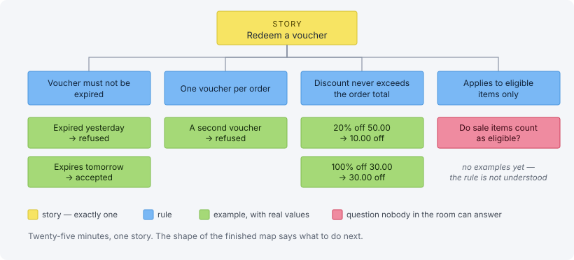

# Example mapping

> Turning a story into rules, examples and open questions in twenty-five
> minutes, using four colours of card — and the move from the story grammar into
> the scenario grammar that a test runner can execute.

A timeboxed conversation that takes one story and breaks it into four kinds of
card. It is the most mechanical of the practices here and the one that most
reliably pays for itself on the first attempt.



Example mapping was created by **Matt Wynne**, co-founder of Cucumber, in his
2015 article *Introducing Example Mapping*. A ready-made template and
walkthrough is at
[draft.io/example/example-mapping](https://draft.io/example/example-mapping).

## The four colours

| Card | Colour | What it holds |
|------|--------|---------------|
| **Story** | Yellow | The one under discussion. There is exactly one. |
| **Rule** | Blue | A constraint or acceptance criterion. |
| **Example** | Green | A concrete case illustrating a rule — real values, not "some input". |
| **Question** | Red | Something nobody in the room can answer. |

## How it runs

Twenty-five minutes, no longer. The three amigos plus a domain expert when the
domain is where the doubt is.

Write the story. Write the rules under it. Under each rule, write examples until
everyone agrees the rule is understood. Whenever someone says "it depends" or
"I'd have to check", that is a **red card** — write it and move on rather than
speculating.

## Reading the map

The shape of the finished map tells you what to do next, before anyone discusses
it:

- **Many red cards** — the story is not ready. Do not estimate it.
- **Many blue cards** — the story is too big. Split it along the rules.
- **A rule with no green cards** — nobody actually understands that rule yet.
- **Many green cards under one rule** — the rule is more complicated than it
  looks, and is often two rules.
- **Few cards, quick agreement** — the story is ready. This is the good outcome
  and it takes ten minutes.

## What it produces

The green cards are the raw material for BDD scenarios and then for the
acceptance tests. Nothing is retyped: the examples written on the wall are the
ones that become `Given / When / Then`, and the ones that decide how the story is
cut into tickets.

### The digital artefact

The map leaves the room as a Gherkin feature file, and the translation is almost
mechanical — three of the four card colours have a keyword of their own:

| Card | Gherkin | Note |
|---|---|---|
| **Story** (yellow) | `Feature:` | One per file |
| **Rule** (blue) | `Rule:` | A real keyword since Gherkin 6 |
| **Example** (green) | `Example:` (or `Scenario:`) | Same word, same meaning as the card |
| **Question** (red) | *nothing* | An open question is not a specification, so it cannot be written as one |

```gherkin
# features/checkout/redeem-a-voucher.feature
Feature: Redeem a voucher

  Rule: A voucher must not be expired

    Example: A voucher that expired yesterday is refused
      Given a voucher "SPRING20" that expired yesterday
      When the customer applies it to a basket of 50.00 CHF
      Then the voucher is refused
      And the basket total is unchanged
```

That file is executed by Cucumber exactly as it stands, and it is what a Story
ticket description is generated from. The wall and the regression suite become
the same artefact — which is the argument set out in full under *digital
artefacts*.

## The second formal language

Story mapping moves a room out of narrative into the story grammar — one role,
one capability, one benefit. Example mapping moves it one rung further, and that
rung is where the words stop being a description and start being executable.

| Level | Language | Shape | What it supports |
|---|---|---|---|
| Narrative | Whatever the room speaks | Prose, conversation, a wall | Shared understanding, and nothing a machine can check |
| **Story-oriented** | The story grammar | `As a … I want … so that …` | Ticketing — scheduling, ordering, sizing |
| **Scenario-oriented** | Gherkin | `Given … When … Then …` | Functional acceptance testing — a machine-checked "done" |

The two formal levels are not competing formats and neither replaces the other.
They answer different questions and different tools consume them: the story level
answers *what does someone want, and why*, and a tracker reads it; the scenario
level answers *what exactly happens, with these values*, and Cucumber runs it.

The transition is what this session is for. A green card is the moment a sentence
acquires values — "a voucher that expired yesterday", "a basket of 50.00 CHF" —
and a sentence with values has an outcome someone can observe, which is the
property `As a … I want …` cannot have no matter how carefully it is worded.

Two rules follow, and both are cheap to apply:

- **Do not write scenarios in narrative.** "Then the discount is applied
  correctly" is a narrative sentence wearing Gherkin's clothes. *Correctly* is
  the word that survived the translation, and it carries no value anyone can
  check.
- **Do not write stories in scenario grammar.** A ticket whose summary is a
  `Given / When / Then` has skipped the level that carries the *why*, and the
  `so that` clause is the only part that can still answer "should we build this?"
  six months from now.

Both formal levels are the same ubiquitous language — same nouns, same verbs, two
grammars. DDD decides the words; these two levels decide the sentence shapes
those words are allowed to appear in.

## Not story mapping

Different axis, different session. Story mapping works across the whole journey
and decides *which* stories exist and in what order; this works on one story and
decides what it *means*. The map picks the next card to open; example mapping
opens it.

## Why the red cards matter most

Every red card is a question that would otherwise have been answered by an
assumption, silently, by whoever hit it first — usually a developer at 4pm on the
last day of the sprint. Making the question visible costs seconds. Discovering
the wrong assumption after release costs a release.

## The official source

[draft.io/example/example-mapping](https://draft.io/example/example-mapping)
carries a usable template, the four-colour convention and a walkthrough, and
points back at Matt Wynne's original article. The blue cards are also the first
draft of the domain's invariants and the words on every card are the ubiquitous
language being written down, which is why this session is worth having a domain
expert in.

---

*Exported from `dev-hub/dev-portal/src/content/docs/doc/practices/example-mapping.mdx`.
Cross-references in the original link to the sibling practices and tools on
dev-portal: `/doc/practices/three-amigos/`, `/doc/practices/bdd/`,
`/doc/practices/atdd/`, `/doc/practices/story-tickets/`,
`/doc/practices/story-mapping/`, `/doc/practices/ddd/`,
`/doc/practices/digital-artefacts/` and `/doc/testing-tools/cucumber/`. The
figure is `public/img/practices/example-mapping.svg` in that component.*
