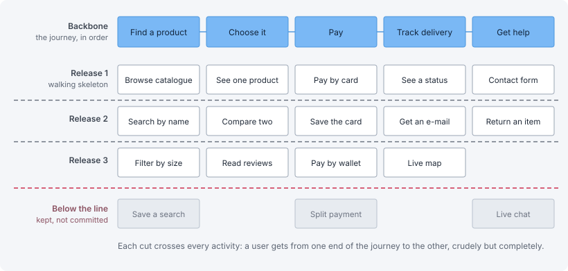

# Story mapping

> Laying the user's journey out along a backbone and slicing it into releases, so
> a backlog keeps the narrative a flat list destroys — and the move from
> narrative speech into the story grammar.

A workshop that arranges everything the product might do into two dimensions: the
user's journey from left to right, and the depth of each step from top to bottom.
The result is a map you can cut horizontally, and each cut is a release.



User story mapping was created by **Jeff Patton**, first in his 2005 article
*It's All in How You Slice It* and then in the book *User Story Mapping: Discover
the Whole Story, Build the Right Product*. A full guide is at
[avion.io/what-is-user-story-mapping](https://www.avion.io/what-is-user-story-mapping/).

It exists because a backlog is a flat list, and a flat list has lost the one
thing that made the work make sense — the order in which a person actually does
things. Two hundred rows sorted by priority cannot answer "what will a user be
able to do at the end of this release?", which is the only question a release
should have to answer.

## The two dimensions

**The backbone**, left to right: the activities a user goes through, in narrative
order. `Find a product`, `Choose it`, `Pay`, `Track delivery`. This is the spine
of the story, told in the order it happens, and it is deliberately at a level
where a non-specialist can read the whole row aloud.

**The body**, top to bottom under each activity: the tasks and variations that
make that step real, ordered by necessity. The item at the top is what the
activity cannot exist without; everything below it is refinement.

## Slicing it

A horizontal cut across the whole map is a release. The first slice is the
thinnest path that still crosses every activity in the backbone — a user can get
from one end of the journey to the other, badly, but completely.

That constraint is the entire value of the technique. Cutting vertically instead
— finishing `Pay` completely before starting `Track delivery` — produces a
sequence of releases in which nobody can do anything until the last one.

- **First slice** — the walking skeleton. Every activity present, each in its
  crudest usable form.
- **Later slices** — depth, added where the evidence says it is worth adding.
- **Below the line** — everything the map holds that nobody has committed to,
  kept visible rather than deleted, because the map is also the record of what
  was consciously not built.

## Who is in the room

The product owner, a UX designer, developers, a quality engineer, domain experts
— and, when it can be arranged, someone who will actually use the thing. It is
the same mixed room as event storming, asking a different question: that workshop
maps what happens in the *domain*, this one maps what happens to a *person*.

## How it differs from example mapping

The two are constantly confused because both involve cards on a wall and both
produce stories. They operate on different axes and neither substitutes for the
other.

| | Story mapping | Example mapping |
|---|---|---|
| **Scope** | The whole journey, many stories at once | Exactly one story |
| **Axis** | Breadth — what exists, and in what order | Depth — what one item actually means |
| **Question** | What do we build, and what does a release give a user? | What are the rules here, and what do we not know? |
| **Duration** | Half a day, occasionally, revisited per release | Twenty-five minutes, per story, continuously |
| **Room** | PO, UX, developers, QE, domain experts, a user | The three amigos, plus a domain expert |
| **Cards** | Activities, tasks, variations | Story, rules, examples, questions |
| **Output** | A backbone with slices — releases and candidate stories | Rules, examples and open questions — scenarios |
| **Prevents** | A pile of features that never adds up to a usable journey | One story meaning something different to each person |

The relationship is sequential: story mapping decides **which stories exist and
in what order**, example mapping decides **what one of them means**. The map
chooses the next card to open; example mapping opens it.

Run without the other, each fails in a recognisable way. Story mapping alone
produces a well-ordered backlog of items nobody can implement without guessing.
Example mapping alone produces beautifully specified stories with no way to tell
whether the set of them adds up to something a user can complete.

## What it produces

A photographed wall, transcribed into the backlog with its structure intact: the
backbone as epics or activities, the slices as releases, the cells as candidate
stories. The cells are not yet tickets — a cell becomes a story, the story goes
through example mapping, and only the scenarios that come out of that become
tickets.

### The digital artefact

The photograph is not the output. Each cell leaves the room as a file, written in
the DSL everyone already recognises and carrying the two coordinates a flat
backlog destroys:

```yaml
# stories/checkout/redeem-a-voucher.yaml
id: CHK-014
activity: Pay                 # position on the backbone
slice: release-1              # which horizontal cut it belongs to

story:
  as: a returning customer
  i_want: to apply a voucher code at checkout
  so_that: I pay the lower price I was promised

scenarios: features/checkout/redeem-a-voucher.feature
questions: []                 # red cards; a non-empty list blocks emission
```

`activity` and `slice` are what let the map be **rebuilt from the repository**
rather than redrawn from memory, and `so_that` is the clause that can still
answer "should we build this?" six months later — it is also the first thing lost
when a story is retyped into a tracker.

The file is what the tracker, and eventually the pipeline, reads. See the
*digital artefacts* practice for the whole chain and for the direction rule that
keeps it trustworthy.

## The language changes in the room

A map starts in **narrative language** — people describing what a user does, in
whatever words they arrived with, with all the ambiguity that implies. It has to
start there, because narrative is the only language everyone in the room already
shares. It cannot end there, because narrative is not checkable: two people can
nod at the same sentence and be holding different pictures.

The workshop's quieter second output is the move out of narrative into the
**first of two formal languages** the rest of the chain runs on.

`As a <role> I want <capability> so that <benefit>` is formal in the only sense
that matters here: it has a fixed number of slots, each slot has to be filled
with something specific, and an empty or generic slot is *visible*. `as: a user`
fails the form. `so_that: the feature is complete` fails the form. The grammar
does not make a story correct — it makes an under-specified story impossible to
hide behind fluent prose.

This level is **story-oriented**: one role, one capability, one reason. That is
exactly the granularity a tracker works at, which is why this is the level that
supports ticket emission — a ticket is a scheduling record of *one thing someone
wants*, and the story grammar is that sentence already in the right shape.

What this level structurally cannot do is decide whether the thing works. `so
that I pay the lower price I was promised` has no values, no preconditions and no
observable outcome. Testability is the second formal level's job, and it is
picked up one session later, in example mapping.

## Common failure modes

- **A backbone of features rather than activities.** `Search`, `Filters`,
  `Sorting` is a component list wearing a narrative's clothes. The test is
  whether a user would recognise the row as a description of their day.
- **The first slice is not a slice.** If it stops short of the last activity,
  it is a vertical cut and the release will demo nothing.
- **Drawn once and never opened.** The map is a planning instrument, not an
  artefact. If it is not re-cut when the evidence changes, the backlog silently
  goes flat again.
- **Mapped by the product owner alone.** Then it records one person's model of
  the journey, which is the assumption the workshop existed to test.

## Where it leads

The slices go to grooming to be ordered and sized. The individual cells go to
three amigos and then example mapping. The journey itself is the *user-first*
artefact the rest of the work is supposed to serve.

## The official source

[avion.io/what-is-user-story-mapping](https://www.avion.io/what-is-user-story-mapping/)
is a full guide to the technique — backbone, steps, stories, releases and the
common mistakes — and it credits Jeff Patton's original article and book, which
remain the primary sources.

---

*Exported from `dev-hub/dev-portal/src/content/docs/doc/practices/story-mapping.mdx`.
Cross-references in the original link to the sibling practices on dev-portal:
`/doc/practices/event-storming/`, `/doc/practices/example-mapping/`,
`/doc/practices/three-amigos/`, `/doc/practices/grooming/`,
`/doc/practices/story-tickets/`, `/doc/practices/digital-artefacts/` and
`/doc/attitudes/user-first/`. The figure is `public/img/practices/story-mapping.svg`
in that component.*
